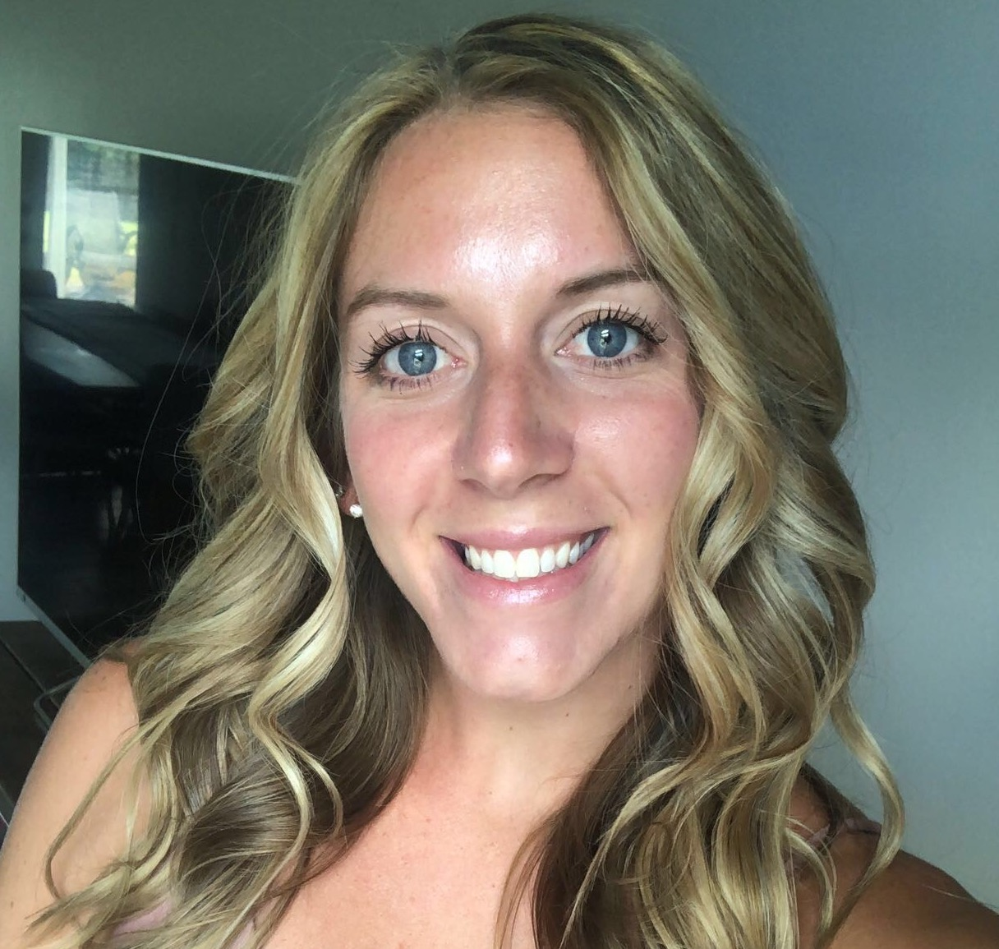

# 2022-2023 - PROJECT5 - ALGORITHMS & DATA STRUCTURE - TEAM 2

## Functional Specifications

📖 Table of content

- [2022-2023 - PROJECT5 - ALGORITHMS \& DATA STRUCTURE - TEAM 2](#2022-2023---project5---algorithms--data-structure---team-2)
  - [Functional Specifications](#functional-specifications)
- [1. Introduction](#1-introduction)
        - [Who is Krug ?](#who-is-krug-)
- [2. Objective](#2-objective)
- [3. Personas](#3-personas)
- [4. Use case](#4-use-case)
- [5. Blending step](#5-blending-step)
- [6. Functionalities](#6-functionalities)
- [7. User interface](#7-user-interface)
- [8. Evaluation criteria](#8-evaluation-criteria)
- [9. Conclusion](#9-conclusion)
- [Reference](#reference)
- [Glosary](#glosary)

# 1. Introduction
The software will assist the Cellar Master and her team in blending the different still wines to create a consistent flavor profile for the Krug Grande Cuvée. The software will optimize the blending process to ensure that the final product is as close as possible to the desired formula, using the minimum number of steps, and without any waste.
More detaily tanks will be used to mix different wines with no thank been partialy filled, so as to get the desired flavor at a precise percentage.

##### Who is Krug ?
Here is a small brief history of Krugs.
Joseph Krug founded the House of Krug in 1843. He was born in 1800, at a time when the city was part of the Napoleonic Empire. He left Mainz in 1824 and by 1834 he was in Paris.Joseph joined Champagne Jacquesson in Châlons-sur-Marne.
Joseph died in 1866 and was succeeded by his son Paul Krug. Joseph had laid the foundations and under the supervision of Paul. By the 1880s the prestige of Krug was acknowledged in the United Kingdom.
After Paul's death in 1910, he was succeeded by his son, Joseph Krug II. However, during World War I Joseph II was taken prisoner and his wife Jeanne played a key role in the House. After the war, Joseph II's slow recovery led to his nephew Jean Seydoux becoming joint manager in 1924. 
In 1959 to 1977, Paul Krug II, the son of Joseph II, succeeded his father. His father died in 1967.In 1962 Henri Krug, the son of Paul II, joined the management, as did his brother Remi three years later. In January 1999 the House became part of LVMH[^1] and by 2007. In 2009 Olivier Krug, the son of Henri, became House director.

# 2. Objective

Blending[^2]: 
1. Create an algorithm that make use of several tanks to blend different varities of wines and comes out with the desire flavor.
2. Implement a user interface that allows the user to input information on the different wines as well as specify the desired flavor profile for the blended wine, and displays the resulting blend and flavor profile.
   
The Krug champagne need this software so as to chose the best path way to know in which tank a particular wine have to go into during blending and to finally have the desired flavor. To have a good result, the following steps under must be taken in to consideration.
  
# 3. Personas
| Name   	| Age 	| Role| Description | Image
|--------	|-----	|-------------|----------|------------|
|Jackson James| 21 | Student |James is a sophisticated student who is on internship in a wine industry, having a deep passion for wine. He explores diverse types and regions, studying oenology and viticulture. Engaging in wine clubs and societies, he shares his knowledge and hosts tastings. James skillfully, immerses himself in wine literature, and embraces its cultural significance. His enthusiasm and knowledge shape his identity and future aspirations for been a winemaker.   |  |
|Sam Keveth | 38 | Manager|Sam is a seasoned wine manager, combining expertise with a discerning palate. With a professional demeanor and an air of authority, he oversees the selection and procurement of wines for a prestigious establishment. Sam's refined taste and extensive knowledge enable him to curate an exceptional wine list. He fosters relationships with wineries, negotiates deals, and ensures optimal inventory management. Passionate about wine education, he conducts staff training and tastings to enhance customer experiences. Sam's attention to detail and dedication to quality make him an invaluable asset in the world of wine |  |
|Zenna Cold | 31 | Worker|Zenna is a diligent worker in a winery production facility. With a strong work ethic and attention to detail, she ensures that every step of the winemaking process is executed flawlessly. Zenna skillfully operates machinery, monitors fermentation, and assists in bottling and labeling. Her knowledge of grape varieties and cellar techniques contributes to the production of high-quality wines. With a deep appreciation for the craft, Zenna takes pride in being part of the winemaking journey from vine to bottle    |  |

# 4. Use case
Description: This use case describes the process of blending different wines to create a new wine blend.

| Name  | Actors | Preconditions | Flow of Events | Assumptions | Notes |
|-------| -------|---------------|----------------|------------|------ |
| Zenna Cold | Winemaker: Responsible for overseeing the blending process. | The winemaker has access to the inventory of wines available for blending. | 1. The winemaker selects the desired wines for blending from the available inventory. 2.The winemaker determines the desired proportions for each wine in the blend. 3.The system prompts the winemaker to input the proportions for each selected wine. 4.The winemaker enters the proportions for each wine and submits the blend request. 5.The system calculates the final blend based on the specified proportions. 6.The winemaker reviews and validates the final blend report. 7.If the winemaker is not satisfied, the process returns to step 2 to adjust the proportions or select different wines for blending. | The winemaker has appropriate access rights and permissions to perform the blending process. | The blend proportions can be expressed as percentages, ratios, or specific measurements depending on the winemaker's preference and the system's implementation |

# 5. Blending step

 1. Selection: Winemakers carefully choose different wines with  to create a desired flavor profile.
 2. Trial Blending: Small-scale blending experiments are conducted, combining different wines in varying proportions to find the ideal blend. Tasting and adjustments are made until the desired result is achieved.
  For example:
   (input --> percatage of wine.
   input --> quantity of wine.
   input --> index[^3] of wine.)[^4]

# 6. Functionalities 
The system will be used to blend individual batches of wine to create a consistent flavor profile.

The information on the individual wines, and the system will generate a customized blend based on the algorithm and database.
  - Add as much as wine you want so the formula.
  - Add as much as tank you want.
  - No half-full.
  - The error margin.

# 7. User interface
The programmes will be running on both Windows and MacOS.

# 8. Evaluation criteria

Here are the criteria that will be used to evaluate the robustness and consistency of the software:

1. Correctness: no crash, no half full or half empty tanks
2. How close your final product is from the input formula
3. Comments and idiomatic style
4. Minimum number of steps to get to the result
5. Speed of the code

# 9. Conclusion

Overall, the goal of the project is to create a system that can produce high-quality blended wines with a consistent flavor profile, while also allowing for customization and flexibility based on user input.

# Reference

Krug Champagne: <a href="https://www.krug.com">Krug Champagne's page</a>

# Glosary
[^1]: LVMH simply means "Moët Hennessy Louis Vuitton".
[^2]: Blending: the still wines from different vineyards and grape varieties are blended together to create a consistent flavor profile.
[^3]: An index is a list of data, such as group of files or database entries.
[^4]: The percentage, quantity, and index of each wine is entered.
