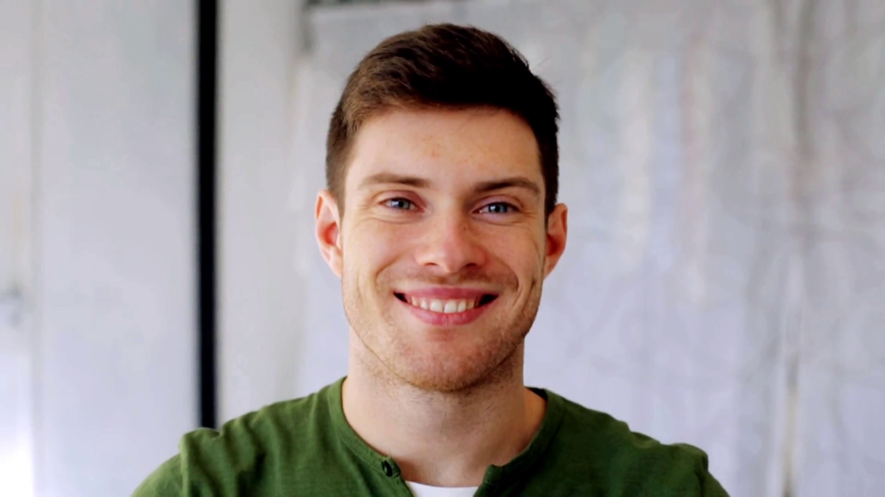

# 2022-2023 - PROJECT5 - ALGORITHMS & DATA STRUCTURE - TEAM 2

## Functional Specifications

📖 Table of content

- [2022-2023 - PROJECT5 - ALGORITHMS \& DATA STRUCTURE - TEAM 2](#2022-2023---project5---algorithms--data-structure---team-2)
  - [Functional Specifications](#functional-specifications)
    - [1. Introduction](#1-introduction)
    - [2. Objective](#2-objective)
    - [3. Personas](#3-personas)
    - [4. Use case](#4-use-case)
    - [5. Blending step](#5-blending-step)
    - [6. Functionalities](#6-functionalities)
    - [7. Interface](#7-interface)
    - [8. Evaluation criteria](#8-evaluation-criteria)
    - [9. Conclusion](#9-conclusion)
    - [Reference](#reference)
    - [Glosary](#glosary)

### 1. Introduction

The software will assist the Cellar Master and their team in blending the different still wines to create a consistent flavor profile. The software will optimize the blending process to ensure that the final product is as close as possible to the desired formula either using the minimum number of steps or make use of a long path way and without lasting for too long.
In order to achieve the satisfactory mix, tanks will be used to mix different wines with the requirement that tanks should be either full or empty, no in-between.

### 2. Objective

Blending[^1]:

1. Create an algorithm that make use of several tanks to blend different varities of wines and comes out with the desired flavor.
2. Implement a user interface that allows the user to input information on the different wines as well as specify the desired number of tanks for the blending process, and displays the resulting blend.

This software to be able to output steps to mix which wines in which tanks in the least amount of steps in order to have the desired flavor. To have a good result, the following steps under must be taken in to consideration(Blending step).

### 3. Personas

| Name | Age | Role| Description | Image |
|------|-----|-----|-------------|-------|
| Jackson James | 21 | Student | Jackson is a sophisticated student who is on internship in a wine industry, having a deep passion for wine. He explores diverse types and regions, studying oenology and viticulture. Engaging in wine clubs and societies, he shares his knowledge and hosts tastings. James skillfully, immerses himself in wine literature, and embraces its cultural significance. His enthusiasm and knowledge shape his identity and future aspirations for been a winemaker.   |  |
|Sam Keveth | 38 |Marketing Manager|Sam is a seasoned wine manager, combining expertise with a discerning palate. With a professional demeanor and an air of authority. He fosters relationships with wineries, negotiates deals, and ensures optimal inventory management. Passionate about wine education, he conducts staff training and tastings to enhance customer experiences.  |  |
| Sheyne Bline | 32 | Manager | Sheyne is the manager, she oversees the selection and procurement of wines for a prestigious establishment. Sheyne's refined taste and extensive knowledge enable her to curate an exceptional wine list. She make sure of the different varieties of wine she choose for the blending process, so as to creat a particular flavor profile. Sheyne's attention to detail and dedication to quality make her an invaluable asset in the world of wine |  |
|Zenna Cold | 31 | Worker|Zenna is a diligent worker in a winery production facility. With a strong work ethic and attention to detail, she ensures that every step of the winemaking process is executed flawlessly. Zenna skillfully operates machinery, monitors fermentation, and assists in bottling and labeling. Her knowledge of grape varieties and cellar techniques contributes to the production of high-quality wines. With a deep appreciation for the craft, Zenna takes pride in being part of the winemaking journey from vine to bottle |  |
| Dany Don | 29 | Worker | Dany Don is a worker in a winery production. With a strong work ethic and attention to detail, He ensures that every tanks are well connected. He skillfully operates machinery. His knowledge, and attention to every detail during connection contributes to the production of high-quality wines. He takes pride in being part of the winemaking. |  |

### 4. Use case

Description: This use case describes the process of blending different wines to create a new wine blend.

| Name  | Actors | Preconditions | Flow of Events | Assumptions | Notes |
|-------| --------- | --------------- |---------------- | ------------ | ------ |
| Sam Keveth | <b>Marketing Manager:</b>  In charge of with stakeholder and market decision-making processes. | 1. The blending process has been developed and is ready for promotion. 2. The marketing manager has a clear understanding of the blending process and its advantages. 3. The target market and customer segments have been identified. |1. The marketing manager meets with the product development team to gather information about the blending process, its features, and the benefits it offers. 2. Based on the information obtained, the marketing manager identifies the target market and customer segments. 3. The marketing manager conducts market research to understand customer preferences, competitors, and market trends related to blended products. | 1. The marketing manager has access to market research data and insights to inform their marketing strategy. 2. The marketing manager has authority and budget allocation to implement the proposed marketing activities. | The marketing manager should collaborate closely with the product development team to ensure a comprehensive understanding of the blending process and its unique selling points |
| Sheyne Bline | <b>Assistant Manager:</b> Oversees the winery operations and responsible for the formula  | 1. The assistant manager has a comprehensive understanding of winemaking processes, including blending techniques. 2. The winery has a range of wines available for blending. | 1. The manager reviews the winery's production plan and identifies the need for wine blending. 2. The manager collaborates with the winemaker and tasting panel to define the blending goals and criteria. 3. The manager select which wines will be use for blending, taking into account their characteristics, quality, and potential for blending. 4. The manager approves the proposed blend or provides feedback for adjustments and iterations. 5. The manager monitors the progress of the blending step, reviewing blending records, and ensuring consistency and accuracy. 6. The manager may conduct sensory evaluations and tasting sessions to validate the final blend's quality and alignment with established criteria.  | 1. The manager possesses the necessary expertise and decision-making authority to guide the blending process. 2. The manager maintains effective communication and collaboration with the winemaker, tasting panel, and other relevant personnel.  | The responsibilities and level of involvement of the manager in the blending step may vary based on winery size, organizational structure, and the manager's role within the winery  |
| Zenna Cold | <b>Winemaker:</b> Responsible for overseeing the blending process. | The winemaker has access to the inventory of wines available for blending. | 1. The winemaker collect information from the manager on the desired wines for blending. 2. The winemaker determines the desired proportions for each wine in the blend. 3. The system prompts the winemaker to input the proportions for each selected wine. 4.The winemaker enters the proportions for each wine and submits the blend request. 5. The system calculates the final blend based on the specified proportions. 6. The winemaker reviews and validates the final blend report. 7. If the winemaker's blend result doesn't satisfied the manager's expectation, the process returns to step 2 to adjust the proportions or select different wines for blending. | The winemaker has appropriate access rights and permissions to perform the blending process. | The blend proportions can be expressed as percentages, ratios, or specific measurements depending on the winemaker's preference and the system's implementation. |
| Dany Don |<b>Winemaker:</b> In charge of the connection of tanks | 1. He make sure all the desired tanks for the blending processes are connected between each of them. 2.He knows wich tank will be used for the blending process | 1. Get informtion on the several varieties of wine that will be used for the blending process with the percentage of each wine, then from these information knows which tanks to be used so as to have a good blending process. 2. Ensures that tanks are carefully, and well connected, so as to avoid wastage of wine(run out or to leak). 3.He makes sure tanks are ready, and connection are done before the start of the blending process, knows the volume of each to be use and where each wine have to be transfer for the blending process to start. | Ensure to do as many connection as possibl, so that there should not be a lack of tank furing the blending process. | He have to constantly check the tanks during the blending process, to ensure that there is no problem at the connection level. |
|Jackson James| <b>Winemaker assistant:</b> Provide support and assistance to the winemaker in various tasks related to the winemaking process| 1.The wine assistant has knowledge of winemaking processes and techniques. 2. The winery and winemaker have identified specific tasks for the wine assistant to perform. | The wine assistant receives instructions from the winemaker regarding the tasks to be performed.| 1. The wine assistant has the necessary training, knowledge, and physical ability to perform assigned tasks. 2. The winemaker provides clear instructions and supervision to the wine assistant. 3. The wine assistant adheres to safety protocols and follows winery guidelines.| The responsibilities and tasks of a wine assistant may vary depending on the winery's size, operations, and the winemaker's preferences |

### 5. Blending step

 1. Selection: Winemakers carefully choose different wines to create a desired flavor profile.
 2. Trial Blending: Small-scale blending experiments are conducted, combining different wines in varying proportions to find the ideal blend. Tasting and adjustments are made until the desired result is achieved.
  For example:
   
   - (input --> Quantity of tanks to be used.
   - input --> index[^2] of wine. 
   - input --> percentage or quantity of wine.)[^3]

### 6. Functionalities

The system will be used to blend individual batches of wine to create a consistent flavor profile.

The information on the individual wines, and the system will generate a customized blend based on the algorithm and database:

- Add as many wines as you want in the formula.
- Add as many tanks as you want.
- Tanks should be full or empty, no in-between.
- The error margin.

### 7. Interface
The software program will run on a window console.[^4]
1. Text option: The program will run as a text file where the following information will be displayed.

- *1. Please enter the quantity/percentage of each wine*
- *2. Start new blend*
- *3. Display the blend result*
- *4. Exit*

2. Input prompts: The user enters the quantity/percentage of the desired number of wines to be blend.

3. Process: After entering the quantity of the different wines, and start the calculation, the process will take a good ammount of time before displaying the result.

4. Output display: After each blend, display relevant information and results to the user. For example, display the final blend result, and any relevant notifications or messages like the total percentage of the blend result, the similarities, that is, how close in percentage our final result is from the users input formula, the number of steps[^5], and finally the time of operation of the overall process.

### 8. Evaluation criteria

Here are the criteria that will be used to evaluate the robustness and consistency of the software:

1. Correctness: no crash, no half full or half empty tanks
2. How close your final product is from the input formula
3. Comments and idiomatic style
4. Minimum number of steps to get to the result
5. Speed of the code

### 9. Conclusion

Overall, the goal of the project is to create a system that can produce high-quality blended wines based on users input.

### Reference

Krug Champagne: [Krug Champagne's page](https://www.krug.com)

### Glosary

[^1]: LVMH simply means "Moët Hennessy Louis Vuitton".
[^2]: Blending: the still wines from different vineyards and grape varieties are blended together to create a consistent flavor profile.
[^3]: An index is a list of data, such as group of files or database entries.
[^4]: The percentage, quantity, and index of each wine are entered.
[^5]: A window console, often referred to as a command prompt or command line interface, is a text-based user interface used in operating systems such as Windows. It provides a way for users to interact with the computer by entering commands and receiving text-based output.
[^6]: Here when we say step, we simply, means 1 transfer, that is the transfer on wine from 1 tank into another one.