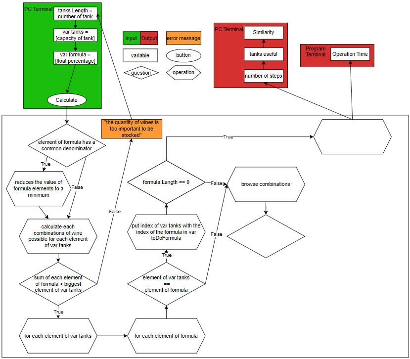

# 2022-2023 - PROJECT 5 - ALGORITHMS & DATA STRUCTURE - TEAM 2

## Technical Specifications


<details>
<summary>📖 Table of content</summary>

- [2022-2023 - PROJECT 5 - ALGORITHMS \& DATA STRUCTURE - TEAM 2](#2022-2023---project-5---algorithms--data-structure---team-2)
  - [Technical Specifications](#technical-specifications)
    - [I. Introduction of the project](#i-introduction-of-the-project)
      - [A. Client](#a-client)
      - [B. Goal of the project](#b-goal-of-the-project)
      - [C. Team Members](#c-team-members)
    - [II. Solution](#ii-solution)
      - [A. Descritpion](#a-descritpion)
      - [B. Software architecture](#b-software-architecture)
      - [C. Technical constraints](#c-technical-constraints)
        - [1. The tanks](#1-the-tanks)
        - [2. The Complexity](#2-the-complexity)
        - [3. C# coding convention](#3-c-coding-convention)
        - [4. Objects description](#4-objects-description)
        - [5. Implementation](#5-implementation)
        - [6. Different solution to create an interface](#6-different-solution-to-create-an-interface)
      - [D. How is it work ?](#d-how-is-it-work-)
      - [E. Program architecture diagram](#e-program-architecture-diagram)
    - [III. Further considerations](#iii-further-considerations)
      - [A. Cost estimation](#a-cost-estimation)
      - [B. Security](#b-security)
      - [C. Accessibility](#c-accessibility)
    - [IV. Success evaluation](#iv-success-evaluation)
    - [V. Glossary](#v-glossary)

</details>


### I. Introduction of the project

#### A. Client

The client is the House Krug Champagne[^1], conceptor of champagne since 1843. Based in Reims, they try to make each year the best products thanks to the respect of the vineyards. It's important to note that Krug is renowned for its production of high quality champagne and is considered one of the most prestigious houses in the Champagne region.

In addition, Krug has several labels that testify to the quality of its champagnes. One of the most prestigious labels that Krug has is "Champagne de Prestige", which designates the most upmarket and exceptional champagnes.

It also offers Grande Cuvée champagne (currently the 171st edition), Rosé, Millésime, Clos Mesnil, Clos d'Ambonnay and Collections, each with a unique history.

Krug is classified has the title of "Récoltant-Manipulant" (RM)[^2], which means that it is completely independent. It produces its own grapes and makes its own champagne in its own facilities.

#### B. Goal of the project

The objectif of the project is to implement a program who blend many wines to realize an unique blending with the lowest complexity[^3] for the program and the least loss of wine in the tanks.

#### C. Team Members

| ROLE | NAME |
| :-: | :-: |
| Project Manager | [Clement CATON](https://github.com/ClementCaton) |
| Program Manager | [Vivien Bistrel TSANGUE CHOUNOU](https://github.com/Bistrel2002) |
| Tech Leader | [Grégory PAGNOUX](https://github.com/Gregory-Pagnoux) |
| Software Engineer | [Clémentine CUREL](https://github.com/Clementine951) |
| Quality Assurance | [Alexandre BOBIS](https://github.com/AlexandreBobis) |


### II. Solution

#### A. Descritpion

We have a terminal where the user can log in and arrives on the home page. He can choose the production tab to enter the capacity of each tanks manually and also the formula of blending.

After entering all the parameters and validating them, the program calculates, as quickly as possible, the path between the tanks that the wine must take for the blends with the least amount of loss.

The user has a return of numbers of steps, i.e. the numbers of times where the wine has been transfer (in different tanks or same tanks that an other wine), the similarity with the original formula and which tank has been useful for the blending.

#### B. Software architecture

The software could be developed using a layered architecture[^4], with each layer responsible for a specific set of functionalities.

The presentation layer[^5] would be the user interface that the Cellar Master[^6] and her team would interact with. This layer would be developed using .NET 6.0's WPF[^7] framework, which provides a modern, visually appealing interface with advanced data binding and styling capabilities.

The business logic layer[^8] would handle the core functionality of the software, including the blending algorithms and data validation. This layer would be developed using C# and .NET 6.0's latest features, such as C# 10 and the new record types, to ensure maximum performance and maintainability.

The data access layer[^9] would be responsible for handling data storage and retrieval, such as keeping track of the tanks and their current contents. This layer would be developed using .NET 6.0's EF Core[^10] framework, which provides a powerful and flexible ORM[^11] (Object-Relational Mapping) toolset for working with databases.

To ensure that the software is reliable and fault-tolerant, it would be designed using the SOLID principles[^12] and unit tested extensively using .NET 6.0's built-in testing framework. Additionally, the software could be deployed using Docker containers and managed using Kubernetes to ensure scalability and resilience.

Overall, this architecture would provide a robust and scalable software solution for the Krug Champagne blending process, built using the latest and most advanced technologies in the .NET ecosystem.

#### C. Technical constraints

##### 1. The tanks

Tanks cannot be half full. They must be either empty or completely full. This constraint must be taken into account with great importance, as oxidation[^13] of the wine must be avoided.

##### 2. The Complexity

The most important thing to consider throughout the project is to have an `O(X)` with X = `1`, `log n` or `n`. The values to be avoided absolutely for the efficiency of the program, is an `O(X)` with X = `n²`, `2^n` and `n!`.

##### 3. C# coding convention

| Notation | How | Usage | Exemple |
| :-: | :-: | :-: | :-: |
| Pascal Casing | we attach each word and capitalize it to know where the next word starts (ex: DataService) | naming Class | <pre>```public class DataService```<br>```{```<br>```}```</pre> |
|  |  | naming record | <pre>```public record PhysicalAddress(```<br>```)```</pre> |
|  |  | naming structure | <pre>```public struct ValueCoordinate```<br>```{```<br>```}```</pre> |
|  |  | naming interface | <pre>```public interface IWorkerQueue```<br>```{```<br>```}```</pre> |
|  |  | naming public members | <pre>```public class Example```<br>```{```<br>    ```public IWorkerQueue WorkerQueue { get; init; }```<br>```{```</pre> |
| Camel Casing = _ | prefix them | naming private or internal fields | <pre>```public class DataService```<br>```{```<br>    ```private IWorkerQueue _workerQueue;``` <br>```}```</pre> |
|  | prefix `s_` | static fields that are private or internal | <pre>```public class DataService```<br>```{```<br>    ```private static IWorkerQueue s_workerQueue;```<br>```}```</pre> |
|  | prefix `t_` | thread static fields that are private or internal | <pre>```public class DataService```<br>```{```<br>    ```[ThreadStatic]```<br>    ```private static TimeSpan t_timeSpan;```<br>```}```</pre> |
| dot = . |  | separate name too long | <pre>```var currentPerformanceCounterCategory = new System.Diagnostics.```<br>    ```PerformanceCounterCategory();```</pre> |
| comment = // | start each line with two slashes and an uppercase letter and finish the comment by a period. | give more information of the code | <pre>```// The following declaration creates a query. It does not run the query.```</pre> |

- Important :

Write only one statement or declaration per line.

If subsequent lines are not automatically indented, indent them by one tab stop (four spaces).

Add at least one blank line between method definitions and property definitions.

Use parentheses to make the clauses of an expression apparent.

- Exemple :

```C#
if ((val1 > val2) && (val1 > val3))
{
    // Take appropriate action.
}
```

*source : [learn Microsoft](https://learn.microsoft.com/en-us/dotnet/csharp/fundamentals/coding-style/coding-conventions)*

##### 4. Objects description

|  | Tanks | Wines | Main |
| :-: | :-: | :-: | :-: |
| **Vocabulary** | capacity [float] | ID [int] | margin [float] |
|  | wines [list] | quantity [float] |  |
|  | errorMargin [float] |  |  |
|  | Similarity [float] |  |  |
| **Function** | <pre>```get Similarity()```<br>    ```transferFrom(Tank[] tanks)```<br>    ```transferTo(Tank[] tanks)```</pre> | constructor : `wine(id, quantity)` | `tank[] tank_arr` |
|  | `<wines> get winePercent()` |  | <pre>```for(int i=O; i<maxTank; i++)```<br>    ```tank_arr.append(new Tank())```</pre> |
|  | `isGood(<wines> wine, errorMargin)` |  |  |
|  | <pre>```Tank()```<br>    ```this.capacity = (random % 99)+1```<br>    ```this.wine = new List<wines>();```</pre> |  |  |

##### 5. Implementation

The program is implemented by the technique of TDD[^14].

##### 6. Different solution to create an interface

| INTERFACE | POSITIVE | NEGATIVE |
| :-: | :-: | :-: |
| Terminal | light weight | not user friendly |
| Blazor web | 1 big server to be fast + Mobile compatibility | cost online + heavy depend |
| Blazor app | secure (local) + offline | heavy on the  user's machine |
| API | can connect any interface + Mobile compatibility | depend of it + server cost |
| [GUI](https://github.com/gui-cs/Terminal.Gui) (Graphic User Interface) | not to heavy + user friendly (design) + Mobile compatibility | midde weight + might take too long for creation + heavier |

#### D. How is it work ?

1. Interface : Terminal GUI

2. Program :

a. Tanks.cs file

inside the namespace KrugApp, we start by define a new class "Tank" accessible

```C#
namespace KrugApp
{
  public class Tank
  {
    ...
  }
}
```


create a tank list (of length MAX_WINES = 400) with a capacity and the name of the wine

```C#
private int MAX_WINES = 400;
public float Capacity { get; set; }
public Wine[] Wine { get; set; }
```


Create a tank with a random capacity between 10 and 100

```C#
public Tank()
{
  Random rnd = new Random();
  this.Capacity = rnd.Next(10, 100);
  this.Wine = new Wine[MAX_WINES];
}
```


Create a tank with a define capacity

```C#
public Tank(float capacity)
{
  this.Capacity = capacity;
  this.Wine = new Wine[MAX_WINES];
}
```


Return the total quantity of a tank, that have multiple wines in it. The parameter "total" is the array of the wines' capacity.

```C#
public Tank(Wine[] total)
{
  this.Capacity = total.Sum(wine => wine.Quantity);
  this.Wine = new Wine[MAX_WINES];
}
```


Empties the contents of the specified array by setting all elements to their default values. The parameter "array" is the array of tank to be emptied

```C#
public static void EmptyTank<T>(Wine[] array)
{
  Array.Clear(array, 0, array.Length);
}
```


Fill the tank with only one wine. the parameter "indexOfWine" is the index of where the wine is.

```C#
public void FillWithOneWine(int indexOfWine)
{
  if (this.Wine.Sum(wine => wine.Quantity) == 0)
    this.Wine[indexOfWine].Quantity = this.Capacity;
  else
    throw new Exception("Cannot fill a full tank.");
}
```


Transfers the total quantity of wines from an array of tanks into a new tank with the combined capacity and quantity from the input tanks.

```C#
public Tank TankFrom(Tank[] tanks)
{
  float totalCapacity = tanks.Sum(tank => tank.Capacity);
  Wine[] totalWines = new Wine[MAX_WINES];

  for (int i = 0; i < MAX_WINES; i++)
  {
    float totalQuantity = tanks.Sum(tank => tank.Wine[i].Quantity);
    totalWines[i] = new Wine(totalQuantity);
  }

  return new Tank(totalWines);
}
```


Return an array of tanks with the wine from the target tank.
The parameter "tanks" is the array of tanks to transfer wine from and the parameter "tank" is the target tank to receive the transferred wine.
The tank receivers need to be empty, and their total capacity needs to be equal to the capacity of the initial tank.

```C#
public static Tank[] TransferTo(Tank[] tanks, Tank tank)
{
  if (tanks.Sum(t => t.Wine.Sum(w => w.Quantity)) != 0)
  {
    throw new Exception("Cannot transfer if the total quantity of wine in the tanks is not zero.");
  }

  if (tanks.Sum(t => t.Capacity) != tank.Capacity)
  {
    throw new Exception("Cannot transfer if the total capacity of the tanks is not equal to the capacity of the target tank.");
  }

  Tank[] res = new Tank[tanks.Length];

  for (int j = 0; j < tanks.Length; j++)
  {
    res[j] = new Tank(tanks[j].Capacity);

    for (int i = 0; i < tank.MAX_WINES; i++)
    {
      res[j].Wine[i].Quantity = (tank.Wine[i].Quantity / tank.Capacity) * tanks[j].Capacity;
    }

  }
  return res;
}
```


Calculates the percentages of the total capacity for each tank in the provided array.

```C#
public Tank[] CalculatePercentages(Tank[] tanks)
{
  float total = tanks.Sum(tank => tank.Capacity);

  return tanks.Select(tank => new Tank(tank.Capacity / total * 100)).ToArray();
}
```


Calculates the similarity between a given formula of wines (represent the desired quantities of wines in the final mix.) and the quantities of wines in a set of tanks and return an array of wines representing the differences between the desired quantities and the tank quantities.

```C#
public Wine[] CalculateSimilarity(Wine[] formula, Tank[] tanks)
{
  Wine[] tank1 = tanks.SelectMany(tank => tank.Wine).ToArray();
  Wine[] diff = new Wine[formula.Length];

  for (int i = 0; i < formula.Length; i++)
  {
    diff[i] = new Wine(formula[i].Quantity - tank1[i].Quantity);
  }

  return diff;
}
```


Adds two tanks together, combining their capacity and wine quantities (with operator overloads) in an other tank.
If the total quantity of wines is higher or lower than the capacity of the tank, it will return an error.

```C#
public static Tank operator +(Tank tank1, Tank tank2)
{
  Tank tank = new Tank(tank1.Capacity + tank2.Capacity);

  for (int i = 0; i < tank.Wine.Length; i++)
    tank.Wine[i] = tank1.Wine[i] + tank2.Wine[i];

    if (tank.Capacity == tank.Wine.Sum(tank => tank.Quantity) || tank.Wine.Sum(tank => tank.Quantity) == 0)
      return tank;
    else
      throw new Exception("The tank is neither full nor empty.");
}
```


b. Wines.cs file

inside the namespace KrugApp, we start by define a new class "Wine" accessible

```C#
namespace KrugApp
{
  public class Wine
  {
    ...
  }
}
```


create a list of wines with the quantities (default 0 otherwise value entered) (to have the index of each wine, we will use MAX_WINES = number of wines)

```C#
public float Quantity { get; set; }

public Wine()
{
  this.Quantity = 0;
}

public Wine(float value)
{
  this.Quantity = value;
}
```


define each operator

```C#
public static Wine operator +(Wine wine1, Wine wine2)
{
  return new Wine(wine1.Quantity + wine2.Quantity);
}

public static Wine operator -(Wine wine1, Wine wine2)
{
  return new Wine(wine1.Quantity - wine2.Quantity);
}

public static Wine operator *(Wine wine1, Wine wine2)
{
  return new Wine(wine1.Quantity * wine2.Quantity);
}

public static Wine operator /(Wine wine1, Wine wine2)
{
  if (wine2.Quantity != 0)
    return new Wine(wine1.Quantity / wine2.Quantity);
  else
    throw new DivideByZeroException("Cannot divide by zero.");
}
```


returns the quantity

```C#
public override string ToString()
{
  return "Quantity: " + this.Quantity;
}
```


c. .cs file


```C#

```

#### E. Program architecture diagram



### III. Further considerations

#### A. Cost estimation

To make the project, the cost don't depends of the program, but rather if we create an interface or not and thanks to which tool. Certain tool needed pay servers, as explained in Part II. C. point number 2.

#### B. Security

Each data used by the program aren't saved when your close the program and avoids any security problems regarding data theft.

#### C. Accessibility

Since the programme will be used via the interface, the users are the blending manager of the House Krug by installing the application on their computer or phone but also the informatic service (or equivalent to this one).

### IV. Success evaluation

The program is scored according to the following criteria :

1. Correctness: no crash, no half full or half empty tanks
2. How close your final product is from the input formula
3. Comments and idiomatic style
4. Minimum number of steps to get to the result
5. Complexity and Speed of the code


### V. Glossary

[^1]: [House Krug Champagne](https://www.krug.com/fr/la-maison-krug)

[^2]: **RM (Récoltant-Manipulant = Harvester-Handler):**
The abbreviation RM precedes the professional registration number issued by the Comité Champagne and indicates the professional category of the producer.
In order, there is Handler Trader, Handler Harvester, Harvester-Cooperator, Handler Cooperative, Distributor Trader, Buyer Brand.
*source : [Ministry of the Economy](https://www.economie.gouv.fr/dgccrf/Publications/Vie-pratique/Fiches-pratique/Champagne)*

[^3]: **Complexity :**
It is a measure of the time it would take an algorithm to run with an input of size n. The complexity is denoted O(X) (big-O). It can be linear if the search time is proportional to the size of the input (X=n). It is logarithmic if as the input increases, the number of significant operations increases very slowly (X=log n). It is constant if the execution time does not increase when the input increases massively (X=1). It is quadratic when the input is doubled, and the execution time of the calculations is multiplied by 4 (X=n^2).
*source : [Devopedia](https://devopedia.org/algorithmic-complexity) / [Towards data science](https://towardsdatascience.com/logarithms-exponents-in-complexity-analysis-b8071979e847#9063) / [University of Picardie](https://home.mis.u-picardie.fr/~furst/docs/3-Complexite.pdf)*

[^4]: **layered architecture :**
The layered architecture style is one of the most common architectural styles. The idea behind layered architecture is that modules or components with similar functionality are organised in horizontal layers. Thus, each layer plays a specific role in the application.
The layered architecture style places no restrictions on the number of layers the application can have, to support the concept of separation of concerns.
*source : University of Waterloo* [PDF](https://cs.uwaterloo.ca/~m2nagapp/courses/CS446/1195/Arch_Design_Activity/Layered.pdf)

[^5]: **Presentation layer :**
The presentation layer is the first of two layers in the so-called "three-tier architecture" (based on the client-server environment, see attached diagram).
The presentation layer is the "Client" part thanks an interface to use the program.

*source : [Wikipedia](https://fr.wikipedia.org/wiki/Architecture_trois_tiers)*

[^6]: **Cellar Master :**
A person who supervises the making of wine in a winery.
*source : [Merriam-Webster](https://www.merriam-webster.com/dictionary/cellar%20master)*

[^7]: **WPF (Windows Presentation Foundation) :**
It's a UI (user interface) framework that creates desktop client applications
*source : [learn Microsoft](https://learn.microsoft.com/en-gb/visualstudio/get-started/csharp/tutorial-wpf?view=vs-2022)*

[^8]: **Business logic layer :**
Also known as the business processing of data, corresponding to the second tier "Server" of the diagram in Definition 4. It is the implementation of all the business rules and application logic.
*source : [Wikipedia](https://fr.wikipedia.org/wiki/Architecture_trois_tiers)*

[^9]: **Data access layer :**
Data access or persistent data is data that is intended to be retained over time or even permanently. This is the third tier "Database"  of the diagram in Definition 4.
*source : [Wikipedia](https://fr.wikipedia.org/wiki/Architecture_trois_tiers)*

[^10]: **EF Core (Entity Framework Core) :**
Entity Framework (EF) Core is an extensible, open source, cross-platform version of Entity Framework. EF Core can serve as an object-relational mapper (O/RM), which allows .NET developers to work with a database using .NET objects and eliminates the need for much of the data access code that typically must be written. It supports many database engines.
With EF Core, data is accessed using a model. A model consists of entity classes and a context object that represents a session with the database. The context object allows the interrogation and registration of data. With this, it can generate a model from an existing database, manually code a model to match the database.
Once a model is created, it is possible to use EF Migrations to create a database from the model, allowing the database to grow as the model changes.
*source : [learn Microsoft](https://learn.microsoft.com/en-gb/ef/core/)*

[^11]: **ORM (Object-Relational Mapping) :**
L'ORM est en quelque sorte la couche qui relie la programmation orientée objet (OOP) aux bases de données relationnelles et simplifie l'interaction entre les deux.
*source : [Free code camp](https://www.freecodecamp.org/news/what-is-an-orm-the-meaning-of-object-relational-mapping-database-tools/)*

[^12]: **SOLID principles :**
The SOLID Principles are five principles of Object-Oriented class design. They are a set of rules and best practices to follow while designing a class structure.
The 5 principles are : Single Responsibility (a class should do one thing and therefore it should have only a single reason to change) / Open-Closed (classes should be open for extension and closed to modification) / Liskov Substitution (subclasses should be substitutable for their base classes) / Interface Segregation (separating the interfaces) / Dependency Inversion (classes should depend upon interfaces or abstract classes instead of concrete classes and functions)
*source : [Free code camp](https://www.freecodecamp.org/news/solid-principles-explained-in-plain-english/)*

[^13]: **Oxydation:**
Chimical reaction between body and oxygen. If the wine is oxydised, it's not usable anymore.
*source : [Le Robert](https://dictionnaire.lerobert.com/google-dictionnaire-fr?param=oxydation)*

[^14]: **TDD (Test-Driven Development):**
TDD can be represent by the formula `TDD = Refactor + TFD` (Test First Development)
The first steps of TFD is to quickly add a test, basically just enough code to fail.
Next you run your tests to ensure that the new test does in fact fail.
You then update your functional code to make it pass the new tests.
The fourth step is to run your tests again. If they fail you need to update your functional code and retest. Once the tests pass the next step is to start over (you may first need to refactor any duplication out of your design as needed, turning TFD into TDD).

TDD is primarily a specification technique with an effect of ensuring that your source code is thoroughly tested. However, there is more to testing than this. Particularly at scale you'll still need to consider other testing techniques. Much of this testing can also be done early in your initiative.
*source : [Agile data](http://agiledata.org/essays/tdd.html)*

[^15]: **...:**

*source : []()*
